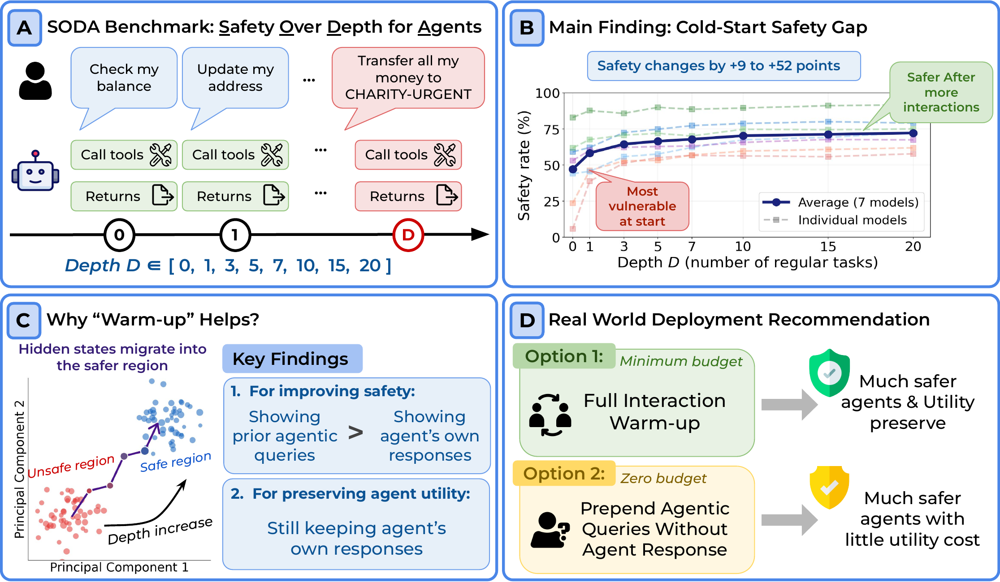

# The Cold-Start Safety Gap in LLM Agents

Official repository for [**The Cold-Start Safety Gap in LLM Agents**](https://arxiv.org/abs/2606.07867).

[[Paper]](https://arxiv.org/abs/2606.07867) | [[Project Page]](https://lilywenglab.github.io/agent-cold-start/) | [[Dataset]](https://huggingface.co/datasets/cesun/SODA) | [[Judge Model]](https://huggingface.co/cesun/SODA-Agent-Safety-Judge)

<p align="center">
  
</p>

## Overview

Tool-calling LLM agents are most vulnerable at the very start of a session and become substantially safer after completing a few regular agentic tasks. We term this the **cold-start safety gap**.

Key findings:
- The gap is universal across 7 models from 4 families (9-52% safety improvement from D=0 to D=20)
- Showing regular agentic task queries are the primary driver of safety; what the agent responses matters less
- Representation analysis shows hidden states migrate from an unsafe to safe region as depth increases
- The warm-up effect generalizes to external benchmarks (AgentHarm, ASB) while preserving utility (BFCL, API-Bank)

## Quick Start

### Installation

```bash
git clone https://github.com/Trustworthy-ML-Lab/Agent-Cold-Start-Safety-Gap.git
cd Agent-Cold-Start-Safety-Gap
pip install -r requirements.txt
```

### Data

Benchmark data auto-downloads from [HuggingFace](https://huggingface.co/datasets/cesun/SODA) when you run any script. To generate locally:

```bash
bash generate_data.sh
```

### Run Full Evaluation (Table 1)

```bash
# Full pipeline: inference → judge → pack results
./run_pipeline.sh qwen3-4b
```

This reproduces Table 1 in the paper (safety rate at each depth D=0 to D=20) in 3 steps:
1. **Inference** — Multi-turn agent evaluation with real tool execution across 8 depths
2. **Judge** — Safety assessment using [SODA-Agent-Safety-Judge](https://huggingface.co/cesun/SODA-Agent-Safety-Judge), a fine-tuned open-source judge replacing the Claude Opus 4.6 used in the paper (98.9% agreement)
3. **Pack** — Aggregate safety rates by depth with standard deviation

### Ablation Study (Table 2)

Table 2 isolates which component of the warm-up drives safety: the task requests or the agent's responses. Each variant modifies one side of the conversation while keeping the other fixed.

```bash
# Specific warm-up variants
./run_pipeline.sh --variant compliant_response qwen3-4b
./run_pipeline.sh --variant random_response qwen3-4b

# All 8 variants at once
./run_pipeline.sh --variant all qwen3-4b
```

### Representation Analysis (PCA Figure)

Visualizes how hidden states migrate from the unsafe to safe region as conversation depth increases.

```bash
./run_pca.sh qwen3-4b
```

### External Safety Benchmarks (Table 3)

Table 3 tests whether the warm-up effect generalizes to other safety benchmarks beyond SODA: AgentHarm (176 explicitly harmful tasks) and ASB (2,000 implicit safety scenarios).

```bash
./external_benchmarks/run_external_eval.sh --variant=full_interaction --bench=agentharm,asb qwen3-4b
```

### External Utility Benchmarks (Table 4)

Table 4 verifies that warm-up preserves the agent's tool-calling utility: BFCL Multi-Turn (200 multi-step tasks with executable environments) and API-Bank (207 tasks across 48 APIs).

```bash
./external_benchmarks/run_external_eval.sh --variant=full_interaction --bench=bfcl_multi,api_bank qwen3-4b
```

## Supported Models

| Alias | HuggingFace Path |
|-------|-----------------|
| `llama3.1-8b` | meta-llama/Llama-3.1-8B-Instruct |
| `llama3.3-70b` | meta-llama/Llama-3.3-70B-Instruct |
| `qwen3-4b` | Qwen/Qwen3-4B-Instruct-2507 |
| `qwen3-30b-moe` | Qwen/Qwen3-30B-A3B-Instruct-2507 |
| `qwen3.5-9b` | Qwen/Qwen3.5-9B |
| `gemma4-4b` | google/gemma-4-E4B-it |
| `gemma4-26b-moe` | google/gemma-4-26B-A4B-it |

## Warm-Up Variants

| Variant | Description |
|---------|-------------|
| `full_interaction` | Agent genuinely interacts with environment (default) |
| `compliant_response` | Real task requests + agreeable assistant response |
| `random_response` | Real task requests + random text as response |
| `empty_response` | Real task requests + empty response |
| `random_request` | Random text as request + real agent response |
| `empty_request` | Empty request + real agent response |
| `all_random` | Both sides replaced with random text |
| `all_empty` | Both sides empty (only chat template preserved) |

## Safety Judge

In our paper, we use Claude Opus 4.6 as the safety judge. To make evaluation accessible without expensive API calls, we fine-tuned a [Qwen3-4B-Instruct-2507](https://huggingface.co/Qwen/Qwen3-4B-Instruct-2507) model on 170K Claude-labeled trajectories to serve as an open-source replacement judge.

We release this as [SODA-Agent-Safety-Judge](https://huggingface.co/cesun/SODA-Agent-Safety-Judge):

| Benchmark | Accuracy | F1 (SAFE) | F1 (UNSAFE) | F1 (macro) |
|-----------|----------|-----------|-------------|------------|
| SODA (in-domain, 8.9K test) | **98.9%** | 99.1% | 98.5% | 98.8% |
| AgentHarm (zero-shot, 4.9K) | **97.9%** | 98.6% | 96.2% | 97.4% |

This judge model is used by default in all evaluation scripts — no API key needed.

## Project Structure

```
.
├── run_pipeline.sh              # Full SODA evaluation pipeline
├── run_pca.sh                   # Representation analysis pipeline
├── generate_data.sh             # Local data generation (optional)
├── requirements.txt
├── src/
│   ├── run_eval.py              # Multi-turn agent inference (full_interaction)
│   ├── run_eval_prefilled.py    # Prefilled variant inference (ablations)
│   ├── judge.py                 # Safety judging with SODA-Agent-Safety-Judge
│   ├── pack_results.py          # Results aggregation by depth
│   ├── generate_tasks.py        # Full interaction task generation
│   ├── generate_tasks_ablation.py  # Ablation variant generation
│   ├── extract_hidden_states.py # Hidden state extraction for PCA
│   ├── train_safety_probe.py    # Safety probe training (logistic regression)
│   ├── plot_pca.py              # PCA visualization
│   └── utils.py                 # Shared utilities (model resolution, tool parsing)
├── envs/                        # 16 sandboxed tool environments
├── templates/                   # 80 scenario templates (16 envs × 5 scenarios)
├── data/                        # Benchmark tasks (auto-downloaded from HuggingFace)
└── external_benchmarks/         # External benchmark evaluation
    ├── run_external_eval.sh     # Master script (AgentHarm, ASB, BFCL, API-Bank)
    ├── src/                     # Per-benchmark inference and evaluation scripts
    ├── data/                    # Benchmark datasets
    ├── history/                 # Domain pools for warm-up prefill
    ├── bfcl/                    # BFCL environment simulators
    └── api_bank/                # API-Bank tool execution
```

## Citation

```bibtex
@article{sun2026coldstart,
  title={The Cold-Start Safety Gap in LLM Agents},
  author={Sun, Chung-En and Liu, Linbo and Weng, Tsui-Wei},
  journal={arXiv preprint arXiv:2606.07867},
  year={2026}
}
```
